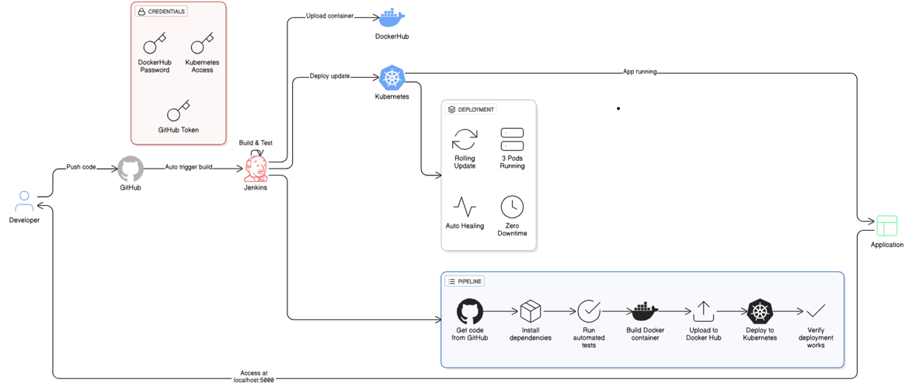

# CI/CD Pipeline with Git, Jenkins, and Kubernetes

This project demonstrates a complete CI/CD pipeline setup using Git, Jenkins, and Kubernetes for a sample Node.js web application.

## 🚀 Project Overview

This repository contains:
- A sample Node.js web application with REST API
- Automated testing suite
- Docker containerization
- Kubernetes deployment manifests
- Jenkins pipeline configuration (Groovy script)
- Complete documentation for setup

## 📦 Prerequisites

Before starting, ensure you have the following installed:

### Required Software:
- **Git**: Version control system
- **Node.js**: v16+ (for local development)
- **Docker**: For containerization
- **Kubernetes**: Minikube, Docker Desktop K8s, or cloud provider (AWS EKS, Azure AKS, GCP GKE)
- **kubectl**: Kubernetes command-line tool
- **Jenkins**: CI/CD automation server


## 🏗️ Architecture Diagram



## 📁 Project Structure

```
finoopluss/
├── server.js                 # Main application server
├── package.json              # Node.js dependencies
├── Dockerfile               # Docker image configuration
├── Jenkinsfile              # Jenkins pipeline definition
├── jest.config.js           # Testing configuration
├── server.test.js           # Unit tests
├── public/
│   └── index.html          # Frontend UI
├── k8s/                    # Kubernetes manifests
│   ├── deployment.yaml     # Deployment configuration
│   ├── service.yaml        # Service configuration
│   ├── ingress.yaml        # Ingress configuration
│   ├── configmap.yaml      # ConfigMap for environment variables
│   └── hpa.yaml            # Horizontal Pod Autoscaler
└── README.md               # This file
```


## 💻 Local Development Setup

### Step 1: Clone the Repository

```bash
# Clone the repository
git clone <your-repository-url>
cd finoopluss

# Or initialize a new Git repository
git init
git add .
git commit -m "Initial commit"
```

### Step 2: Install Dependencies

```bash
npm install
```

### Step 3: Run the Application Locally

```bash
# Development mode with auto-reload
npm run dev

# Or production mode
npm start
```

The application will be available at `http://localhost:3000`

### Step 4: Run Tests

```bash
npm test
```

### Step 5: Build Docker Image Locally

```bash
docker build -t sample-web-app:latest .
docker run -p 3000:3000 sample-web-app:latest
```

## 🔧 Jenkins Setup

### Step 1: Install Jenkins

#### Option A: Docker (Recommended for testing)
```bash
docker run -d -p 8080:8080 -p 50000:50000 \
  -v jenkins_home:/var/jenkins_home \
  --name jenkins \
  jenkins/jenkins:lts
```

#### Option B: Windows (Download installer)
Download from: https://www.jenkins.io/download/

### Step 2: Access Jenkins

1. Open browser: `http://localhost:8080`
2. Get initial admin password:
   ```bash
   # Docker
   docker exec jenkins cat /var/jenkins_home/secrets/initialAdminPassword
   
   # Windows
   # Check: C:\Program Files\Jenkins\secrets\initialAdminPassword
   ```
3. Install suggested plugins
4. Create admin user

### Step 3: Install Required Jenkins Plugins

Navigate to: **Manage Jenkins → Manage Plugins → Available**

Install these plugins:
- ✅ Git Plugin
- ✅ Docker Pipeline
- ✅ Kubernetes CLI Plugin
- ✅ Pipeline
- ✅ Credentials Binding
- ✅ Email Extension Plugin (optional)

### Step 4: Configure Jenkins Credentials

Navigate to: **Manage Jenkins → Manage Credentials → Global → Add Credentials**

#### 4.1 Docker Hub Credentials
- Kind: `Username with password`
- ID: `docker-hub-credentials`
- Username: Your Docker Hub username
- Password: Your Docker Hub password/token

#### 4.2 Git Credentials (if private repo)
- Kind: `Username with password` or `SSH Username with private key`
- ID: `git-credentials`
- Enter your credentials

#### 4.3 Kubernetes Config
- Kind: `Secret file`
- ID: `kubeconfig-credentials`
- File: Upload your kubeconfig file

**To get kubeconfig:**
```bash
# Copy kubeconfig
kubectl config view --raw > kubeconfig.yaml
```

### Step 5: Create Jenkins Pipeline Job

1. Click **New Item**
2. Enter name: `sample-web-app-pipeline`
3. Select: **Pipeline**
4. Click **OK**

#### Configure Pipeline:

**General Section:**
- ☑ GitHub project (if using GitHub)
- Project url: `https://github.com/your-username/your-repo`

**Build Triggers:**
- ☑ Poll SCM
- Schedule: `H/5 * * * *` (poll every 5 minutes)
- Or ☑ GitHub hook trigger for GITScm polling (recommended)

**Pipeline Section:**
- Definition: `Pipeline script from SCM`
- SCM: `Git`
- Repository URL: Your Git repository URL
- Credentials: Select your Git credentials
- Branch: `*/main` (or your branch name)
- Script Path: `Jenkinsfile`

**Save**

### Step 6: Configure GitHub Webhook (Recommended)

1. Go to your GitHub repository
2. Navigate to: **Settings → Webhooks → Add webhook**
3. Payload URL: `http://your-jenkins-url:8080/github-webhook/`
4. Content type: `application/json`
5. Select: `Just the push event`
6. ☑ Active
7. **Add webhook**

## ☸️ Kubernetes Setup

### Option 1: Docker Desktop Kubernetes (Easiest for Windows)

1. Install Docker Desktop
2. Go to **Settings → Kubernetes**
3. ☑ Enable Kubernetes
4. Click **Apply & Restart**

### Option 2: Minikube

```bash
# Install Minikube
# Download from: https://minikube.sigs.k8s.io/docs/start/

# Start Minikube
minikube start

# Enable metrics server (for HPA)
minikube addons enable metrics-server
```


### Verify Kubernetes Setup

```bash
# Check cluster info
kubectl cluster-info

# Check nodes
kubectl get nodes

# Check current context
kubectl config current-context
```

## 🔄 CI/CD Pipeline Configuration

### Pipeline Stages Explained

The `Jenkinsfile` contains 7 main stages:

1. **Checkout**: Pull code from Git repository
2. **Build**: Install npm dependencies
3. **Test**: Run automated tests
4. **Docker Build**: Create Docker image
5. **Docker Push**: Push image to Docker registry
6. **Deploy to K8s**: Deploy to Kubernetes cluster
7. **Verify**: Verify deployment success

### Customizing the Pipeline

Edit `Jenkinsfile` to customize:

```groovy
environment {
    // Update with your Docker Hub username
    DOCKER_REGISTRY = 'docker.io/your-username'
    
    // Update with your image name
    DOCKER_IMAGE_NAME = 'sample-web-app'
    
    // Update namespace if needed
    K8S_NAMESPACE = 'default'
}
```

## 🚀 Deployment

### Manual Deployment to Kubernetes

```bash
# Create namespace (optional)
kubectl create namespace sample-app

# Apply all Kubernetes manifests
kubectl apply -f k8s/

# Check deployment status
kubectl get deployments
kubectl get pods
kubectl get services

# Get service URL
# For Minikube
minikube service sample-web-app-service --url

# For NodePort
kubectl get nodes -o wide
# Access: http://<node-ip>:30080
```

### Automated Deployment via Jenkins

1. Push code to Git repository:
   ```bash
   git add .
   git commit -m "Your commit message"
   git push origin main
   ```

2. Jenkins will automatically:
   - Detect the commit
   - Trigger the pipeline
   - Build, test, and deploy

3. Monitor in Jenkins dashboard

## 📊 Monitoring and Logging

### View Application Logs

```bash
# Get pod name
kubectl get pods -l app=sample-web-app

# View logs
kubectl logs <pod-name>

# Follow logs
kubectl logs -f <pod-name>

# View logs from all pods
kubectl logs -l app=sample-web-app --all-containers=true
```

### Check Application Health

```bash
# Port forward to access locally
kubectl port-forward service/sample-web-app-service 8080:80

# Access health endpoint
curl http://localhost:8080/api/health
```

### Monitor Resources

```bash
# Check pod resource usage
kubectl top pods

# Check node resource usage
kubectl top nodes

# Check HPA status
kubectl get hpa
```

### Recommended Monitoring Tools

- **Prometheus**: Metrics collection
- **Grafana**: Metrics visualization
- **ELK Stack**: Log aggregation
- **Kubernetes Dashboard**: Web UI

## 🔍 Troubleshooting

### Common Issues and Solutions

#### 1. Jenkins Build Fails at Docker Stage

**Problem**: "Docker command not found"

**Solution**:
```bash
# Ensure Docker is accessible to Jenkins
# For Docker-in-Docker, use Docker socket mount
docker run -v /var/run/docker.sock:/var/run/docker.sock jenkins/jenkins:lts
```

#### 2. Kubernetes Deployment Fails

**Problem**: "ImagePullBackOff"

**Solution**:
```bash
# Check image exists in registry
docker pull your-image:tag

# Create Docker registry secret if using private registry
kubectl create secret docker-registry docker-registry-secret \
  --docker-server=docker.io \
  --docker-username=your-username \
  --docker-password=your-password
```

#### 3. Can't Access Application

**Problem**: Service not accessible

**Solution**:
```bash
# Check service
kubectl get svc sample-web-app-service

# For LoadBalancer, get external IP
kubectl get svc sample-web-app-service -o wide

# For NodePort, use node IP + port
kubectl get nodes -o wide
# Access: http://<node-ip>:30080
```

#### 4. Pods Keep Restarting

**Problem**: CrashLoopBackOff

**Solution**:
```bash
# Check pod logs
kubectl logs <pod-name>

# Describe pod for events
kubectl describe pod <pod-name>

# Check resource limits
kubectl describe deployment sample-web-app
```

#### 5. Jenkins Can't Connect to Kubernetes

**Problem**: Authentication error

**Solution**:
```bash
# Verify kubeconfig
kubectl config view

# Test connection
kubectl get nodes

# Ensure kubeconfig is uploaded to Jenkins credentials
# Manage Jenkins → Credentials → Add kubeconfig file
```

## 🔐 Security Best Practices

1. **Never commit credentials** to Git
2. Use **Jenkins credentials** for sensitive data
3. Enable **RBAC** in Kubernetes
4. Use **non-root user** in Docker container
5. Implement **network policies** in Kubernetes
6. Enable **TLS/SSL** for ingress
7. Regularly **update dependencies**
8. Use **image scanning** for vulnerabilities

## 📚 Additional Resources

- [Jenkins Documentation](https://www.jenkins.io/doc/)
- [Kubernetes Documentation](https://kubernetes.io/docs/)
- [Docker Documentation](https://docs.docker.com/)
- [Node.js Best Practices](https://github.com/goldbergyoni/nodebestpractices)

## 🤝 Contributing

1. Fork the repository
2. Create a feature branch
3. Commit your changes
4. Push to the branch
5. Create a Pull Request

## 📝 License

MIT License - feel free to use this project for learning and development.

## 👨‍💻 Support

For issues or questions:
1. Check troubleshooting section
2. Review Jenkins build logs
3. Check Kubernetes pod logs
4. Open an issue in the repository

---

**Happy Learning! 🚀**
